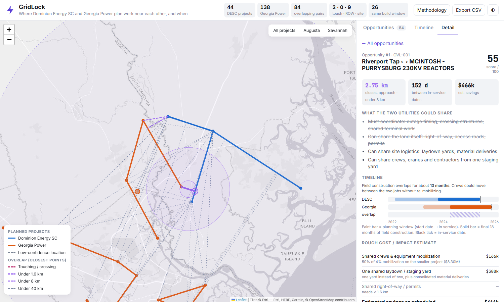

# GridLock: Cross-Utility Transmission Overlap Finder

GridLock reads the public construction plans of **Dominion Energy South Carolina (DESC)** and **Georgia Power (GPC)**, puts every planned project on a map, and ranks the places where the two utilities will be working near each other at around the same time. Those are the places where they could share crews, equipment, laydown yards, right-of-way and outage windows.

It was built for the ShellHacks 2026 Sperry Tech **GridLock Challenge**, a hackathon-sized version of the coordination problem behind FERC Order No. 1920.



## Run it

The web app is **React + GSAP**, built with Vite (`web/`). The data pipeline is Python (`pipeline/`).

**Quickest way to view it:** double-click **`web/dist/index.html`**. It's a single self-contained file, so no server or install is needed.
(Don't open `web/index.html` directly. That's the development entry point and only works through Vite.)

```bash
# Develop / rebuild the app
cd web
npm install
npm run dev            # http://localhost:5173   (…/#reveal=1 starts the guided walkthrough)
npm run build          # rebuilds web/dist/index.html (single file) + web/dist/sources/ PDFs

# Rebuild the data from the source PDFs (writes web/src/data/grid.json)
python -m pip install -r requirements.txt
python pipeline/run_all.py
```

Geocoding results are cached in `data/cache/`, so a rebuild runs offline and gives the same output.

## What you can do in the UI

- **Map:** DESC projects in blue, Georgia Power in orange. Dashed connectors join the *closest points* of each overlapping pair, coloured by tier. Selecting a pair draws its 1.6 / 8 / 40 km rings. Low-confidence locations are drawn dashed. Click any project for its details.
- **Ranked opportunities:** live filters for distance, in-service gap, timeline weight, "build windows overlap", location confidence, and GTC/MEAG partner projects.
- **Detail view:** what the two utilities could share at this distance, a two-project timeline with the construction overlap hatched, both source records (with PDF page numbers and per-endpoint geocode provenance), and an **editable cost/impact estimate**.
- **Timeline tab:** a Gantt chart of every project involved in an overlap, grouped into the Augusta and Savannah areas. Hovering a row highlights its partners on the map.
- **▶ Reveal top opportunity:** a five-step guided walkthrough (problem → the two projects → closest points → timing → value), built as a GSAP timeline. It has a progress bar and keyboard control (Space pause, → next step, Esc stop). Use it for the live demo; see [docs/DEMO.md](docs/DEMO.md).
- **Motion (GSAP):** the selected overlap connector draws itself from one project to the other, the 1.6 / 8 / 40 km rings expand, scores and counts tick up, list cards and Gantt bars stagger in, and the Impact funnel narrows step by step. Everything respects `prefers-reduced-motion`.
- **Why was this flagged?** Every opportunity explains in plain English why it matched, with a score breakdown (proximity points + timing points − confidence deduction).
- **Impact tab:** a funnel from every pair checked down to the short list (showing how non-overlaps are filtered out), portfolio savings ranges without double-counting, shareable resource types, and the Augusta vs. Savannah split.
- **Evidence:** every project links to its page in the original public PDF.
- **Export CSV** of the current ranking, **Methodology** panel, light and dark themes, and deep links (`#sel=OVL-004`, `#tab=timeline&zoom=savannah`).

## How it works

| Stage | Script | What it does |
|---|---|---|
| 1. Parse | `pipeline/parse_projects.py` | Extracts all **44 DESC projects** (SCRTP ≥ $2M list: ID, description, status, in-service date, year-by-year budget) and all **208 Georgia ITS projects** (IRP Vol. 3 Table 2 joined to the per-project detail pages on the TEAMS number, giving zone, sponsor, need date, **start date** and description). 138 are Georgia Power (GPC + SAV). The other 70 are GTC, MEAG and Dalton Utilities, available as an optional layer. |
| 2. Locate | `pipeline/geocode.py` | Splits each project name into its named substations (`Okatie-Bluffton 115kV` → Okatie, Bluffton). Each substation is matched to hand-verified coordinates first (`data/manual_locations.json`, every entry with a source), then OpenStreetMap substations and plants (Overpass), then Nominatim. **False-match guards:** the location must be inside the correct state polygon, within 100 km of the project's GA planning zone, and consistent with the line's stated mileage. For example, these guards caught "Grady – West End" (Atlanta) matching a Florida substation and a Columbia, SC neighbourhood. Every endpoint carries a *high / medium / low* confidence and a note saying where it came from. |
| 3. Overlap | `pipeline/overlaps.py` | Computes the **closest-point distance** between every DESC × Georgia pair (segment-to-segment, not centre-to-centre) and keeps pairs under 40 km. It assigns tiers (touching < 0.1 km · < 1.6 km · < 8 km · < 40 km) and build windows: GPC uses its filed start date, and DESC uses its first budget year with spend. The construction window is the final 18 months before in-service. It then scores and ranks the pairs and writes `overlaps.csv` and `web/data.js`. |

**Score** = `geo × ((1 − w) + w × timing) × confidence`
- `geo`: 100 → 0 across the four distance tiers (closer is better).
- `timing`: 1 if the construction windows overlap, otherwise fading to 0 over a 4-year gap in in-service dates.
- `w`: timeline weight, 40% by default. Geography is the primary signal and timing the secondary one, as the brief asks. It's adjustable in the UI.
- `confidence`: 1 / 0.9 / 0.75 for high / medium / low location confidence.

## Results

Out of 6,966 DESC × Georgia project pairs, **84 overlap** (< 40 km), and all 84 involve Georgia Power itself. As the brief predicted, most of the data doesn't overlap. The matches fall into two clusters on the Savannah River:

| # | DESC project | Georgia Power project | Closest | Tier | Construction overlap |
|---|---|---|---|---|---|
| 1 | Riverport Tap: Construct (Okatie–Riverport 230 kV) | McIntosh – Purrysburg 230 kV reactors | 2.75 km | < 8 km | 13 months |
| 2 | Jasper – Okatie 230 kV #2: Construct | Goshen (SAV) – McIntosh 115 kV rebuild | 4.81 km | < 8 km | ~1 month |
| 3 | Okatie 230-115 kV Sub / Jasper–Yemassee fold-in | McIntosh – Purrysburg 230 kV reactors | 4.51 km | < 8 km | ~1 month |
| 4 | Jasper – Okatie 230 kV #2: Construct | McIntosh – Purrysburg 230 kV reactors | 4.51 km | < 8 km | 13 months |
| 5 | Hooks – Thurmond 115 kV tie rebuild | Evans Primary – Thurmond Dam #5 115 kV rebuild | shared switchyard | touching | none (8.4 yrs apart) |
| 9 | Urquhart – Toolebeck 115 kV rebuild | Fenwick St – Sand Bar Ferry 115 kV reconductor | 9.3 km | < 40 km | 15 months |

- **Savannah / Lowcountry:** DESC's Jasper–Okatie–Riverport build-out sits directly across the river from Georgia Power's Plant McIntosh work. The McIntosh–Purrysburg tie lines physically join the two systems, and DESC's new Riverport industrial-park tap lands 2.75 km from the Purrysburg end, with both jobs in the field during 2025–26.
- **Augusta:** DESC's Hooks–Thurmond tie and Georgia Power's Evans–Thurmond #5/#6 rebuilds terminate at the **same** J. Strom Thurmond Dam switchyard. They're scheduled 8 years apart, which is exactly the kind of mismatch that coordination could fix. Separately, DESC's Urquhart–Toolebeck rebuild and GPC's Fenwick St reconductor near downtown Augusta overlap in time for about 15 months.

These results agree with the sponsor's starter table: Hooks–Thurmond ↔ Evans–Thurmond and Jasper–Okatie ↔ McIntosh were both flagged there. GridLock adds the higher-ranked Riverport pairing, which the starter set didn't cover.

### Cost / impact example (bonus)

**#1 Riverport Tap ↔ McIntosh–Purrysburg reactors** (2.75 km apart, 13 months of simultaneous construction):

| Mechanism | Estimate | Basis |
|---|---|---|
| Shared crew & equipment mobilization | ~$166k | 50% of a 4% mobilization cost on the smaller job (GPC ~$8.3M est.) |
| One shared laydown / staging yard | ~$300k | one yard instead of two, plus consolidated deliveries |
| **Total as scheduled** | **~$466k (range $280k–$700k)** | range = 0.6× to 1.5× the central estimate |

For comparison, the **touching** Thurmond pair would avoid about 1.6 km of parallel corridor (~4.3 acres of 100-ft right-of-way at 35% shared width), a second permit package and a second outage/crossing design. That comes to roughly **$0.46M as scheduled, rising to about $0.8M** if the two rebuilds were resequenced into the same window. Every assumption (easement $/acre, mobilization %, yard cost, $/mile by voltage) can be edited in the detail view. Georgia Power's own cost figures are redacted in the public IRP, so its project costs are estimated per mile and labelled as estimates.

## Data sources

- DESC: *Planned Transmission Projects $2M and above, 2024–2028* (SCRTP), `data/raw/Project Listings/Dominion Energy/`
- Georgia Power: *2025 IRP Volume 3, Public Disclosure*, Georgia ITS Ten-Year Plan 2025–2034, `data/raw/Project Listings/Georgia Power/`
- Sperry starter workbook `data/raw/Projects_Overlaps.xlsx` (seed coordinates)
- OpenStreetMap via the Overpass API and Nominatim (© OpenStreetMap contributors). Base map tiles © Esri.

Only public filings are used. Redacted (CEII) fields stay redacted.

## Limitations

- Lines are straight segments between substations, not surveyed routes (the same approximation the brief describes).
- DESC's **Hooks** substation isn't in any public map data. It's estimated at Clarks Hill, SC, using the PDF's "~2.3 miles" Hooks–Thurmond description, and flagged low-confidence. New substations (Dawson, Scout, Big Ogeechee) are placed from their descriptions.
- 47 of 252 projects (mostly interior Georgia, far from SC) couldn't be located reliably and are left off the map rather than guessed. None of them are near the state line.
- Cost figures are planning-level estimates meant to size the opportunity, not engineering estimates.

## Repo layout

```
pipeline/   parse_projects.py · geocode.py · overlaps.py · run_all.py
data/raw/            challenge PDFs + starter workbook
data/manual_locations.json   hand-verified coordinates (with sources)
data/cache/          OSM / Nominatim / state-boundary responses (for reproducible offline runs)
data/processed/      desc_projects.json · gpc_projects.json · projects_geo.json · overlaps.json · overlaps.csv
web/        React + GSAP app (Vite)
  src/lib/model.js       scoring, filtering, cost model (mirrors pipeline/overlaps.py)
  src/lib/anim.jsx       GSAP setup, CountUp
  src/components/        MapView (Leaflet), OpportunityList, Detail, Impact, Timeline, Reveal, …
  src/data/grid.json     generated by the pipeline
web-vanilla/  the earlier no-build version of the UI (kept as a fallback)
```
